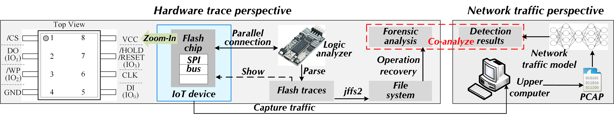

# CMD: Co-analyzed IoT Malware Detection and Forensics via Network and Hardware Domains



## Introduction

CMD is a co-analyzed IoT malware detection and forensics system that combines network and hardware perspectives. 
From network-side traffic identification, CMD realizes to capture contextual semantics from cross-sources flows. 
From the host-side SPI traces analysis, CMD achieves a side-channel-manner log recovery for on-chip operations. 
This anonymous repository shows part source code including the model architecture and file operation recovery process implementation. 

## Requirements

```bash
pip install scipy
pip install numpy
pip install pandas
pip install tqdm
pip install pyecharts
pip install joblib
pip install pickle
pip install sklearn
```

## Hardware

- W25Q128FV Flash chip: [W25Q128FV Datasheet](https://www.pjrc.com/teensy/W25Q128FV.pdf)


## Model Interpretability

- Captum: [Captum: Model Interpretability for PyTorch](https://captum.ai/)
  - e.g., Attribution map

### References
- [Kitsune: An Ensemble of Autoencoders for Online Network Intrusion Detection](https://arxiv.org/abs/1802.09089), Yisroel Mirsky, Tomer Doitshman, Yuval Elovici, and Asaf Shabtai - NDSS 2018
- [Realtime Robust Malicious Traffic Detection via Frequency Domain Analysis](https://dl.acm.org/doi/10.1145/3460120.3484585), Chuanpu Fu, Qi Li, Meng Shen, and Ke Xu - CCS 2021


